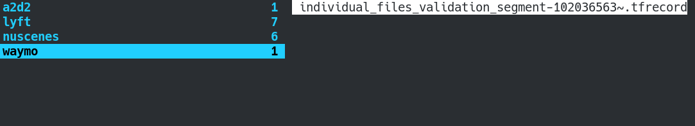

# Installing needed packages

```bash
pip install -U nuscenes-devkit lyft_dataset_sdk numpy pyquaternion tensorflow==2.6.0 waymo-open-dataset-tf-2-6-0 keras==2.6.0
```

# Using Manual

## Import
```python
import dataset_wrapper as dw
```
## Initialisation
### NuScenes

```python
dawr = dw.DatasetWrapper(dw.NUSCENES_NAME, "global_path_to_dataset")
```
In NuScenes case path should be to "nuscenes" folder which contains data same as at right side of screenshot  


### Level5
```python
dawr = dw.DatasetWrapper(dw.LYFT_NAME, "global_path_to_dataset")
```
In Level5 case path should be to "lyft" folder which contains data same as at right side of screenshot  


### A2D2
```python
dawr = dw.DatasetWrapper(dw.A2D2_NAME, "global_path_to_dataset")
```
In a2d2 case path should be to "a2d2" folder which contains data same as at right side of screenshot  


### Waymo

```python
dawr = dw.DatasetWrapper(dw.WAYMO_NAME, "global_path_to_dataset")
```
In Waymo case path should be to "waymo" folder which contains data same as at right side of screenshot ( .tfrecords )


## Using
### get_item(int,int)
Main method, which returns data of frame
```python
dawr.get_item(scene_number: int, frame_number: int) -> dict('dataset_type': str, 'coordinates': np.array,'transformation_matrix': np.array,'boxes': list, 'labels' : list)
```
'dataset_type' values: 
* 'unrecognized' - unrecognized type
* 'train' — training type
* 'valid' — validation type
* 'test' — testing type

'coordinates': np.array[**num**][x]
* **num** — number of point 
* **dim** — dimension, list [x,y,z]

'motion_flow_annotation': np.array[**num**][**dim**]
* **num** — number of point 
* If scene doesn't have previous frame (current frame is first) all values of list is **None**
* If point is out of the box or isn't previous annotation of the box, it's motion flow annotation is **None**
* Right point annotation is in format [vx, vy, vz]. Velocity of x,y,z coordinate (m/s).
* [About Motion Flow annotation](https://arxiv.org/pdf/2103.01306v3.pdf "https://arxiv.org/pdf/2103.01306v3.pdf")

'transformation_matrix' — 4x4 transformation matrix to 3D coordinates

'boxes' — list of dicts [dict('category_id': int, 'size': list,'center': list, 'orientation': real),...]. Returns empty list if frame don't have boxes.
 * 'category_id' — id of boxcategory ( check [Categories_documentation.md](Categories_documentation.md) )
 * 'size' — [length, width, height], length, width, height of box
 * 'center' — coordinates of box center [x,y,z]
 * 'orientation' — box yaw angle [-pi, pi)

'labels' — labels[**num**], list of categories corresponding to **num** point in coordinates list. Returns empty list if frame don't have label segmentation.
* **num** — number of point in coordinates array

### visualization_sample(item)
Visualize sample points and boxes via open3d
```python
    item = dawr.get_item(1,1)
    dawr.visualization_sample(item)
```


### get_map()
Check documentation in [Maps_documentation.md](Maps_documentation.md)
```python
dawr.get_map()
```

### get_dataset_categories()
Return local dataset categories list with description (different format) 
```python
dawr.get_dataset_categories()
```
### get_unificated_categories()
Returns unificated categories dictionary in format {id: 'name',...}
```python
dawr.get_unificated_categories()
```

### get_category_by_id()
Returns unificated category name (string) by id 
```python
dawr.get_category_by_id(id: int)
```

